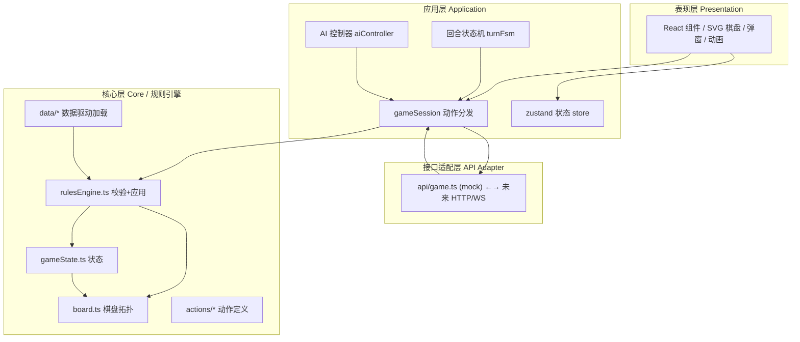
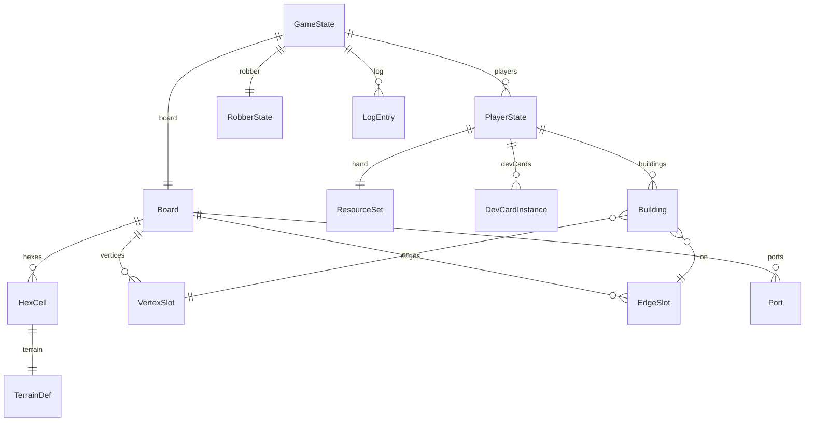

# 技术架构文档 - Web 版《卡坦岛：航海家》

> 本文件定义 Web 版前端的分层架构、目录结构、数据模型、后端接口预留。
> 架构原则对齐 Godot 版 `/workspace/docs/02_ARCHITECTURE.md`，规则引擎保持等价语义。

---

## 1. 架构设计



### 1.1 依赖规则
- **L1 不依赖任何上层**：规则引擎是纯 TS 模块，无 React / DOM / 网络依赖，可在 Node 中单元测试
- **L2 依赖 L1**：通过 actions + rulesEngine 驱动状态
- **L3 当前为 mock**：接口签名与未来 HTTP 实现一致，切换时只改 `api/` 内部
- **L4 仅依赖 L2/L3**：UI 不直接修改状态，通过 dispatch Action 提交

## 2. 技术选型

| 项目 | 选型 | 说明 |
|------|------|------|
| 框架 | React 18 + TypeScript | 函数组件 + Hooks |
| 构建 | Vite 5 | 极速 HMR |
| 样式 | TailwindCSS 3 | 实用类 + 主题色变量 |
| 状态 | Zustand | 轻量 store，无样板 |
| 图标 | lucide-react | 一致风格 |
| 字体 | Cinzel + Crimson Text + Fira Code | Google Fonts |
| 随机数 | Mulberry32 + 种子 | 可复现棋盘 |
| 后端 | 无（mock） | 接口预留 |

**初始化命令**（pnpm 优先）：
```bash
pnpm create vite-init@latest web --template react-ts --force
```

## 3. 目录结构

```
/workspace/web/
├── public/
│   └── fonts/                    # 本地字体回退（按需）
├── src/
│   ├── api/                      # L3: 后端接口适配层
│   │   ├── types.ts              # API 请求/响应类型（与后端协议对齐）
│   │   ├── gameApi.ts            # 游戏动作 API 接口
│   │   └── mock/                 # 当前 mock 实现
│   │       ├── mockGameApi.ts    # 本地规则引擎驱动
│   │       └── aiAdapter.ts      # AI 决策适配
│   ├── core/                     # L1: 规则引擎（纯 TS，无 React）
│   │   ├── board.ts              # 六边形拓扑 + 顶点/边归一化
│   │   ├── hexCoord.ts           # 轴向坐标系
│   │   ├── gameState.ts          # 游戏状态 + 玩家状态
│   │   ├── rulesEngine.ts        # 校验 + 应用 + 事件产出
│   │   ├── result.ts             # Result<T> 类型
│   │   ├── rng.ts                # 种子随机数
│   │   ├── actions/              # 动作定义
│   │   │   ├── types.ts          # Action 联合类型
│   │   │   ├── build.ts          # BuildAction
│   │   │   ├── trade.ts          # TradeAction
│   │   │   ├── rollDice.ts       # RollDiceAction
│   │   │   ├── moveRobber.ts     # MoveRobberAction
│   │   │   ├── useDevCard.ts     # UseDevCardAction
│   │   │   ├── discard.ts        # DiscardAction
│   │   │   └── endTurn.ts        # EndTurnAction
│   │   └── data/                 # 数据驱动加载
│   │       ├── terrains.ts       # 地形定义（移植自 terrains.json）
│   │       ├── buildings.ts      # 建筑成本
│   │       ├── devCards.ts       # 发展卡定义
│   │       ├── ports.ts          # 港口定义
│   │       └── scenarios/        # 场景布局
│   │           ├── base4p.ts     # 基础 4 人
│   │           ├── newWorld.ts   # 新世界
│   │           └── desert.ts     # 深入沙漠
│   ├── app/                      # L2: 应用层
│   │   ├── gameSession.ts        # 动作分发 + 事件汇总
│   │   ├── turnFsm.ts            # 回合状态机
│   │   ├── aiController.ts       # AI 决策（中等策略）
│   │   └── boardGenerator.ts     # 棋盘生成（地形/数字/港口随机分布）
│   ├── store/                    # L2: Zustand 状态
│   │   ├── gameStore.ts          # 全局游戏状态快照
│   │   └── uiStore.ts            # UI 状态（选中、模式、弹窗）
│   ├── components/               # L4: 表现层组件
│   │   ├── board/                # 棋盘相关
│   │   │   ├── BoardView.tsx     # SVG 棋盘容器
│   │   │   ├── HexTile.tsx       # 单个六边形
│   │   │   ├── NumberToken.tsx   # 数字牌
│   │   │   ├── VertexSlot.tsx    # 顶点（定居点/城市）
│   │   │   ├── EdgeSlot.tsx      # 边（道路/船只）
│   │   │   ├── Robber.tsx        # 强盗
│   │   │   └── Port.tsx          # 港口标记
│   │   ├── buildings/            # 建筑 SVG
│   │   │   ├── Settlement.tsx
│   │   │   ├── City.tsx
│   │   │   ├── Road.tsx
│   │   │   └── Ship.tsx
│   │   ├── dice/                 # 骰子
│   │   │   └── Dice3D.tsx
│   │   ├── cards/                # 资源卡 / 发展卡
│   │   │   ├── ResourceCard.tsx
│   │   │   ├── DevCard.tsx
│   │   │   └── HandPanel.tsx
│   │   ├── panels/               # 侧边面板
│   │   │   ├── PlayerBar.tsx     # 顶部玩家状态栏
│   │   │   ├── BuildPanel.tsx    # 建造按钮
│   │   │   ├── TradeDialog.tsx   # 交易对话框
│   │   │   ├── TurnLog.tsx       # 回合日志
│   │   │   └── PhaseHint.tsx     # 阶段提示
│   │   ├── dialogs/              # 弹窗
│   │   │   ├── DiscardDialog.tsx
│   │   │   ├── RobberDialog.tsx
│   │   │   ├── GoldChoiceDialog.tsx
│   │   │   ├── MonopolyDialog.tsx
│   │   │   ├── YearOfPlentyDialog.tsx
│   │   │   └── VictoryDialog.tsx
│   │   └── ui/                   # 通用 UI
│   │       ├── Parchment.tsx     # 羊皮纸背景容器
│   │       ├── InkButton.tsx     # 墨水描边按钮
│   │       └── Modal.tsx
│   ├── pages/                    # 页面级组件
│   │   ├── MainMenu.tsx
│   │   ├── GameScreen.tsx
│   │   └── VictoryScreen.tsx
│   ├── hooks/                    # 自定义 Hooks
│   │   ├── useGameActions.ts     # 派发 Action
│   │   ├── useBoardInteraction.ts
│   │   └── useAiTurn.ts
│   ├── utils/                    # 工具
│   │   ├── hexMath.ts            # 六边形像素坐标转换
│   │   ├── colors.ts             # 主题色
│   │   └── format.ts             # 日志格式化
│   ├── App.tsx                   # 根组件（状态切换）
│   ├── main.tsx                  # 入口
│   ├── index.css                 # Tailwind + 全局样式
│   └── vite-env.d.ts
├── index.html
├── package.json
├── tsconfig.json
├── tsconfig.node.json
├── vite.config.ts
├── tailwind.config.js
├── postcss.config.js
└── README.md                     # 简短运行说明（按需）
```

## 4. 后端 API 接口预留

### 4.1 设计原则
- 所有客户端动作通过 `gameApi` 提交，返回权威状态快照 + 事件流
- 当前 mock 实现复用前端规则引擎；联机时替换为 fetch/WebSocket
- 协议版本化，未来不兼容升级会提升 `protocolVersion`

### 4.2 接口定义

```typescript
// src/api/types.ts
export interface ApiRequest<TPayload> {
  protocolVersion: 1;
  sessionId: string;
  playerId: string;
  action: GameAction;
  payload?: TPayload;
}

export interface ApiResponse<TData> {
  ok: boolean;
  error?: { code: string; message: string };
  data?: TData;
  events: GameEvent[];
  snapshot: GameStateSnapshot;
}

export interface GameStateSnapshot {
  board: BoardSnapshot;
  players: PlayerSnapshot[];
  currentPlayerId: string;
  phase: GamePhase;
  turnOrder: string[];
  dice: { d1: number; d2: number; total: number } | null;
  robberHex: HexCoord;
  longestRoadPlayerId: string | null;
  largestArmyPlayerId: string | null;
  bank: ResourceSet;
  devCardDeckCount: number;
  log: LogEntry[];
}
```

### 4.3 接口列表

```typescript
// src/api/gameApi.ts
export interface GameApi {
  createSession(config: SessionConfig): Promise<ApiResponse<SessionCreated>>;
  submitAction(sessionId: string, playerId: string, action: GameAction): Promise<ApiResponse<void>>;
  getSnapshot(sessionId: string, playerId: string): Promise<ApiResponse<GameStateSnapshot>>;
  subscribeEvents(sessionId: string, onEvent: (e: GameEvent) => void): Unsubscribe;
}

// 当前 mock 实现（src/api/mock/mockGameApi.ts）
// 未来真实实现（src/api/http/httpGameApi.ts）只需替换为 fetch / WebSocket
```

## 5. 数据模型

### 5.1 核心数据模型 ER



### 5.2 关键类型定义

```typescript
// 资源类型
type ResourceType = 'wood' | 'brick' | 'sheep' | 'wheat' | 'ore';
type ResourceSet = Record<ResourceType, number>;

// 地形
type TerrainId = 'mountains' | 'hills' | 'forest' | 'fields' | 'pasture' | 'desert' | 'gold' | 'shallow_water' | 'deep_water';

// 建筑类型
type BuildingType = 'road' | 'ship' | 'settlement' | 'city';

// 玩家颜色
type PlayerColor = 'red' | 'blue' | 'white' | 'orange';

// 阶段
type GamePhase =
  | 'setup_forward'      // 正向放置 1
  | 'setup_reverse'      // 逆序放置 2
  | 'roll'               // 掷骰
  | 'action'             // 行动
  | 'robber_discard'     // 弃牌
  | 'robber_move'        // 移动强盗
  | 'robber_steal'       // 偷资源
  | 'game_over';

// 动作联合类型
type GameAction =
  | { type: 'place_initial'; vertexId: number; edgeId: number }
  | { type: 'roll_dice' }
  | { type: 'build'; building: BuildingType; positionId: number }
  | { type: 'trade_bank'; give: ResourceSet; receive: ResourceType; portId?: string }
  | { type: 'trade_player'; targetPlayerId: string; give: ResourceSet; receive: ResourceSet }
  | { type: 'use_dev_card'; cardId: string; payload?: DevCardPayload }
  | { type: 'move_robber'; hexCoord: HexCoord; stealTargetPlayerId?: string }
  | { type: 'discard'; playerId: string; cards: ResourceSet }
  | { type: 'end_turn' };
```

### 5.3 数据驱动文件

直接移植 Godot 版 `project/data/*.json` 的结构到 `src/core/data/*.ts`，作为只读数据对象。规则代码引用数据对象，不引用字面量。

## 6. 关键算法

### 6.1 六边形坐标系
- 轴向坐标 (q, r) 表示六边形
- 顶点归一化：以整数物理坐标 `(2q+r+dx, 3r+dy)` 为 canonical key，避免 sqrt(3) 浮点误差
- 边归一化：以 `(min_vertex_id, max_vertex_id)` 为 canonical key
- 像素坐标（pointy-top, size=1）：`x = sqrt(3) * (q + r/2)`, `y = 1.5 * r`

### 6.2 棋盘生成
1. 按场景定义生成六边形集合（含海洋/岛屿）
2. 按 §3 规则随机分配地形（带 6/8 不相邻约束）
3. 按"逆时针螺旋"分配数字牌
4. 随机分配 9 个港口到边界顶点

### 6.3 规则校验
- `validate(action, state): Result`：纯校验
- `apply(action, state): { state: GameState, events: GameEvent[] }`：执行
- 不可变原则：返回新状态，便于未来事件流同步

### 6.4 最长道路
- BFS 遍历玩家道路/船只网络
- 处理断链规则（对手定居点插入）
- 道路与船只混合计算

### 6.5 AI 策略（中等）
1. 优先建造顺序：定居点 > 城市 > 发展卡 > 道路
2. 选址：评分 = 资源概率 × 玩家稀缺度
3. 7 点：移到对手高产地形，偷资源最多者
4. 交易：仅在能凑齐关键建造时使用 4:1

## 7. 状态同步策略

- 当前为单进程 mock：`apply` 直接返回新状态 + 事件，UI 订阅 store 刷新
- 未来联机：服务端权威，客户端发送 Action，接收 Event 增量 + 周期 Snapshot
- 接口签名已对齐未来协议，切换时仅改 `api/` 实现

## 8. 测试策略

- L1 规则引擎：Vitest 单元测试，覆盖：
  - 棋盘拓扑归一化
  - 建造合法性（距离规则、连接性）
  - 资源产出（强盗压制、黄金选择）
  - 交易（4:1 / 3:1 / 2:1）
  - 强盗移动与偷取
  - 发展卡效果（5 种）
  - 最长道路、最大军队
  - 胜利判定
- L4 组件：React Testing Library 冒烟测试
- 测试文件镜像 `src/` 结构放在 `src/**/*.test.ts`

## 9. 性能与边界

- 棋盘 SVG 节点数：19-30 六边形 + ~54 顶点 + ~72 边，DOM 节点 < 500，无性能问题
- 状态更新通过 Zustand selector 精细订阅，避免全量 re-render
- AI 决策同步执行（规则简单，<100ms）
