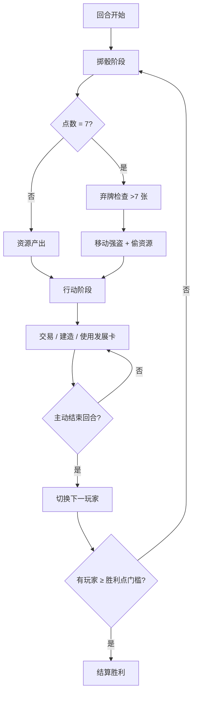

# 产品需求文档 (PRD) - Web 版《卡坦岛：航海家》

> 本文件是 Web 版前端的产品规格。所有页面、交互、规则表现以本文件为准。
> 规则实现严格对齐 `/workspace/docs/01_GAME_RULES.md`（Godot 版权威规则）。

---

## 1. 产品概述

- 一款浏览器中可运行的《卡坦岛》(Catan) 桌游电子化实现，覆盖**基础版 + 海洋扩展 (Seafarers)** 完整规则。
- 当前阶段交付**可运行前端**（单机热座模式 + 简单 AI 对手），并预留后端联机接口。
- 目标用户：项目所有者个人游玩，以及未来联机对战的客户端载体。

## 2. 核心特性

### 2.1 用户角色

| 角色 | 描述 |
|------|------|
| 人类玩家 | 4 人内通过同一设备热座轮流操作，或与 AI 混合 |
| AI 玩家 | 内置中等策略 AI，作为缺位玩家补位 |

### 2.2 功能模块

1. **主菜单页**：开局配置（玩家数、AI 数、场景选择、随机种子、胜利点门槛）
2. **游戏主界面**：棋盘、骰子、手牌、建筑面板、交易对话框、发展卡、回合状态、日志
3. **结算页**：胜利者展示、终局统计、返回主菜单

### 2.3 页面详情

| 页面 | 模块 | 功能描述 |
|------|------|---------|
| 主菜单 | 开局配置 | 玩家数 2-4、AI 数 0-3、场景选择（基础版 / 新世界 / 深入沙漠）、随机种子输入、胜利点门槛（默认 10）、开始按钮 |
| 主菜单 | 规则速查 | 折叠面板展示建造成本、发展卡效果、港口规则、胜利点构成 |
| 游戏主界面 | 六边形棋盘 | SVG 渲染地形/数字牌/强盗/建筑/道路/船只/港口；点击顶点/边触发建造模式 |
| 游戏主界面 | 骰子区 | 两颗骰子动画 + 当前点数；掷骰按钮 |
| 游戏主界面 | 玩家状态栏 | 4 名玩家头像、颜色、当前回合高亮、胜利点、资源卡数、骑士数、最长道路/最大军队徽章 |
| 游戏主界面 | 当前玩家手牌 | 5 种资源卡数量、发展卡列表、可点击使用 |
| 游戏主界面 | 建造面板 | 道路/船只/定居点/城市/发展卡按钮，显示成本，资源不足置灰 |
| 游戏主界面 | 交易对话框 | 与银行/港口 4:1 / 3:1 / 2:1；与玩家间交易提案与确认 |
| 游戏主界面 | 回合日志 | 滚动日志：掷骰结果、产出、建造、交易、强盗、发展卡使用 |
| 游戏主界面 | 阶段提示条 | 当前阶段（初始放置 1/2、掷骰、行动、强盗、弃牌）+ 操作引导 |
| 游戏主界面 | 弃牌弹窗 | 手牌 >7 时强制选弃牌；自动按向下取整计数 |
| 游戏主界面 | 强盗移动 | 7 点触发：选目标六边形 → 选偷取玩家 |
| 游戏主界面 | 黄金选择 | 产出黄金地形时弹出资源选择 |
| 游戏主界面 | 垄断卡弹窗 | 选择目标资源 → 执行效果 |
| 游戏主界面 | 发明卡弹窗 | 选择 2 张资源（可同种） |
| 游戏主界面 | 道路建设卡 | 连续放置 2 条道路 |
| 结算页 | 胜利展示 | 胜利者颜色 + 名字 + 胜利点构成表 |
| 结算页 | 终局统计 | 各玩家建筑统计、骑士数、最长道路长度 |
| 结算页 | 操作 | 再来一局（同配置）/ 返回主菜单 |

## 3. 核心流程

### 3.1 开局流程
1. 主菜单配置开局参数 → 生成随机棋盘（地形/数字牌/港口按 §3 规则）
2. 进入初始放置阶段：玩家 1→4 顺序放 1 定居点 + 1 道路，再 4→1 逆序放第 2 套
3. 第 2 个定居点放置后立即获得相邻地形初始资源

### 3.2 回合流程

### 3.3 后端接口预留
所有状态变更通过 `api/game.ts` 中的接口抽象，当前以本地 mock 实现，未来切换为 HTTP/WebSocket 调用即可联机。

## 4. 用户界面设计

### 4.1 设计风格

**视觉概念：航海地图 (Cartographer's Atlas)**
- 灵感：16 世纪航海图、古旧羊皮纸、手绘海图、海军日志
- 主色：
  - 羊皮纸底色 `#f0e2c1`（基础）/ `#e8d8b0`（深色）
  - 海洋深蓝 `#1e3a5f`（浅海）/ `#0f2438`（深海）
  - 墨水黑 `#2b1810`（边线、文字）
  - 朱砂红 `#c4421f`（重点强调、玩家红）
- 地形色块：
  - 山脉 `#8a8d8f`（石灰岩）
  - 丘陵 `#b86b3a`（砖红）
  - 森林 `#2d5a3d`（深林绿）
  - 麦田 `#d4a23a`（金黄）
  - 牧场 `#8fbf5e`（青草绿）
  - 沙漠 `#e6c878`（沙黄）
  - 黄金 `#e6b840`（金光）
- 玩家色：红 `#c4421f` / 蓝 `#2b6cb0` / 白 `#e8e2d5`（米白）/ 橙 `#dd7e2c`
- 字体：
  - 标题：`Cinzel`（罗马式衬线，航海日志感）
  - 正文：`Crimson Text`（古典衬线）
  - 数字/数据：`Fira Code`（等宽，骰子点数 / 资源数）

### 4.2 UI 元素风格

- 六边形：木刻描边 + 中心资源图标（SVG 几何图形）+ 数字牌以圆形纸片叠加
- 数字牌：6/8 标红，其余黑墨；带"概率点"装饰（小圆点表示概率高低）
- 建筑：3D 透视 SVG（定居点=小屋、城市=教堂塔、道路=木桥、船只=帆船）
- 资源卡：纸卡质感 + 圆角 + 玩家颜色背纹
- 骰子：3D CSS 骰子翻滚动画，落定时高亮
- 港口：海岸线上的小图标（船锚/木桶/羊/麦穗/矿镐/通用）
- 强盗：黑色棋子图标，移动时平滑动画
- 按钮：羊皮纸按钮 + 悬浮阴影 + 墨水描边

### 4.3 页面设计概览

| 页面 | 模块 | UI 元素 |
|------|------|---------|
| 主菜单 | Hero | 全屏航海图背景，居中标题卡，配置面板浮于地图上 |
| 主菜单 | 玩家槽位 | 4 个彩色头像框，可切换人类/AI/空 |
| 主菜单 | 场景选择 | 三张卡片：基础 / 新世界 / 深入沙漠，悬停展开说明 |
| 游戏主界面 | 顶部状态栏 | 4 玩家面板横排，当前回合者高亮 + 翻转动画 |
| 游戏主界面 | 中央棋盘 | 全屏 SVG，可拖动平移、滚轮缩放 |
| 游戏主界面 | 左侧面板 | 当前玩家手牌 + 发展卡 |
| 游戏主界面 | 右侧面板 | 建造按钮 + 交易按钮 + 回合日志 |
| 游戏主界面 | 底部骰子 | 居中两颗 3D 骰子 + 掷骰按钮 + 当前点数 |
| 游戏主界面 | 弹窗 | 居中半透明遮罩 + 羊皮纸卡片内容 |
| 结算页 | 全屏 | 胜利者大色块 + 统计表 + 再来一局按钮 |

### 4.4 响应式

- **桌面优先**（最低 1280×800），平板/移动端可滚动查看但非首要适配
- 棋盘支持鼠标拖动 + 滚轮缩放，确保大棋盘也能完整操作
- 弹窗在小屏改为底部抽屉式

### 4.5 动效

- 入场动画：羊皮纸卷轴展开效果
- 回合切换：玩家头像框光晕扫描
- 掷骰：3D 翻滚动画 1.2s
- 资源产出：资源图标从对应六边形飘向玩家手牌
- 建造放置：建筑从中心缩放落入位置
- 强盗移动：弧线滑行动画
- 胜利：金色粒子从胜利者头像爆发，全屏闪光

## 5. 技术约束

- 桌面浏览器：Chrome / Edge / Firefox / Safari 最新两个版本
- 单页应用，无需路由（主菜单 → 游戏 → 结算 状态切换）
- 所有规则逻辑放在前端 core 层（与 Godot 版规则一致）
- 后端接口预留：`src/api/` 下的服务接口，当前以 mock 实现
- AI 决策在前端运行（与人类玩家共享规则引擎）
